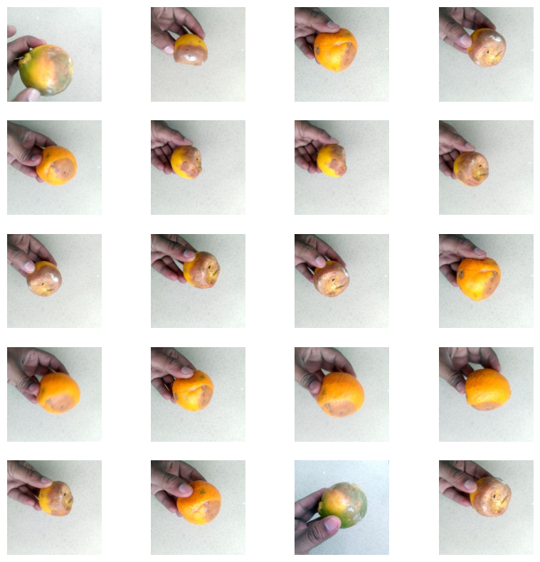
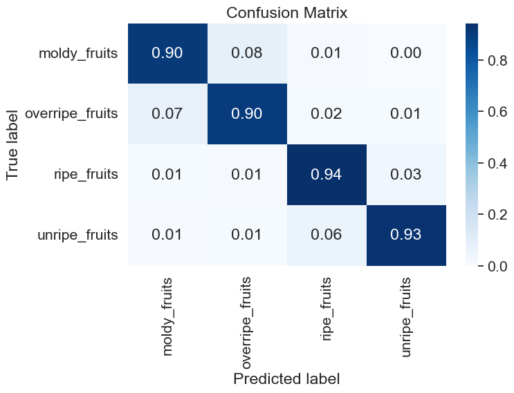
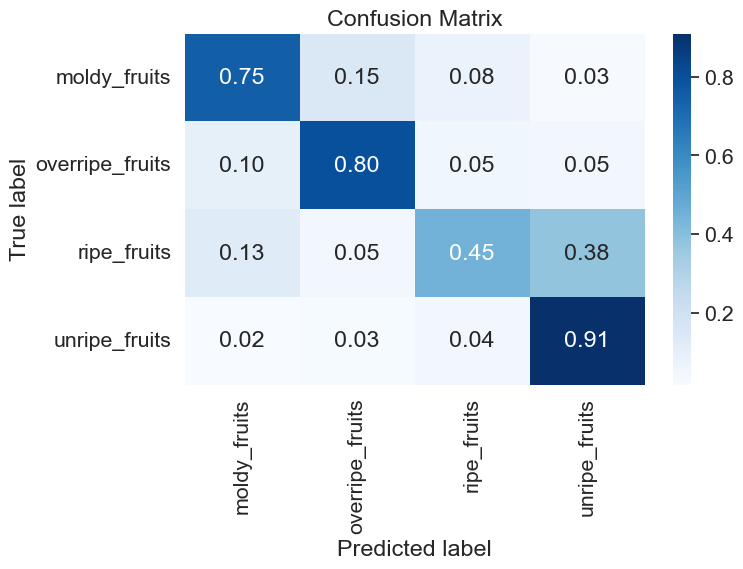
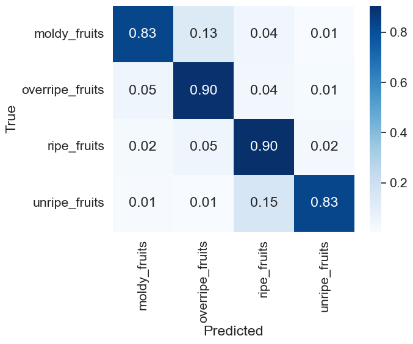
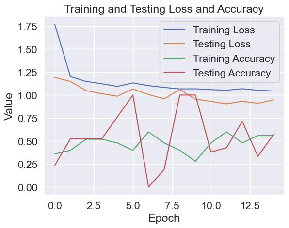
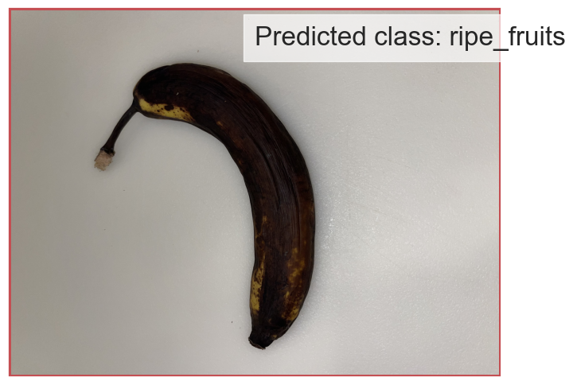
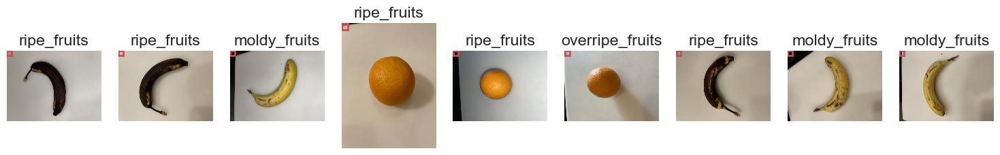

## Data mount and Path Set-up for the Project on the Google Drive


```python
from google.colab import drive
drive.mount('/content/gdrive')

# Uncomment when there was error in mounting , make a back-up folder and mount the data
# from google.colab import drive
# import shutil
# drive_path = '/content/gdrive'
# backup_path = '/content/backup'
# shutil.move(drive_path, backup_path)
# drive.mount(drive_path)
```

    Mounted at /content/gdrive


```python
# Data Path Setup
data_path = "/content/gdrive/MyDrive/'Colab Notebooks'/hci575_data/"
data_path
```


    "/content/gdrive/MyDrive/'Colab Notebooks'/hci575_data/"


```python
!pip  install -q kaggle
```


```python
from google.colab import files
files.upload()
```


     <input type="file" id="files-604af184-517e-4ee2-b275-170996836ab0" name="files[]" multiple disabled
        style="border:none" />
     <output id="result-604af184-517e-4ee2-b275-170996836ab0">
      Upload widget is only available when the cell has been executed in the
      current browser session. Please rerun this cell to enable.
      </output>
      <script>// Copyright 2017 Google LLC
//
// Licensed under the Apache License, Version 2.0 (the "License");
// you may not use this file except in compliance with the License.
// You may obtain a copy of the License at
//
//      http://www.apache.org/licenses/LICENSE-2.0
//
// Unless required by applicable law or agreed to in writing, software
// distributed under the License is distributed on an "AS IS" BASIS,
// WITHOUT WARRANTIES OR CONDITIONS OF ANY KIND, either express or implied.
// See the License for the specific language governing permissions and
// limitations under the License.

/**
 * @fileoverview Helpers for google.colab Python module.
 */
(function(scope) {
function span(text, styleAttributes = {}) {
  const element = document.createElement('span');
  element.textContent = text;
  for (const key of Object.keys(styleAttributes)) {
    element.style[key] = styleAttributes[key];
  }
  return element;
}

// Max number of bytes which will be uploaded at a time.
const MAX_PAYLOAD_SIZE = 100 * 1024;

function _uploadFiles(inputId, outputId) {
  const steps = uploadFilesStep(inputId, outputId);
  const outputElement = document.getElementById(outputId);
  // Cache steps on the outputElement to make it available for the next call
  // to uploadFilesContinue from Python.
  outputElement.steps = steps;

  return _uploadFilesContinue(outputId);
}

// This is roughly an async generator (not supported in the browser yet),
// where there are multiple asynchronous steps and the Python side is going
// to poll for completion of each step.
// This uses a Promise to block the python side on completion of each step,
// then passes the result of the previous step as the input to the next step.
function _uploadFilesContinue(outputId) {
  const outputElement = document.getElementById(outputId);
  const steps = outputElement.steps;

  const next = steps.next(outputElement.lastPromiseValue);
  return Promise.resolve(next.value.promise).then((value) => {
    // Cache the last promise value to make it available to the next
    // step of the generator.
    outputElement.lastPromiseValue = value;
    return next.value.response;
  });
}

/**
 * Generator function which is called between each async step of the upload
 * process.
 * @param {string} inputId Element ID of the input file picker element.
 * @param {string} outputId Element ID of the output display.
 * @return {!Iterable<!Object>} Iterable of next steps.
 */
function* uploadFilesStep(inputId, outputId) {
  const inputElement = document.getElementById(inputId);
  inputElement.disabled = false;

  const outputElement = document.getElementById(outputId);
  outputElement.innerHTML = '';

  const pickedPromise = new Promise((resolve) => {
    inputElement.addEventListener('change', (e) => {
      resolve(e.target.files);
    });
  });

  const cancel = document.createElement('button');
  inputElement.parentElement.appendChild(cancel);
  cancel.textContent = 'Cancel upload';
  const cancelPromise = new Promise((resolve) => {
    cancel.onclick = () => {
      resolve(null);
    };
  });

  // Wait for the user to pick the files.
  const files = yield {
    promise: Promise.race([pickedPromise, cancelPromise]),
    response: {
      action: 'starting',
    }
  };

  cancel.remove();

  // Disable the input element since further picks are not allowed.
  inputElement.disabled = true;

  if (!files) {
    return {
      response: {
        action: 'complete',
      }
    };
  }

  for (const file of files) {
    const li = document.createElement('li');
    li.append(span(file.name, {fontWeight: 'bold'}));
    li.append(span(
        `(${file.type || 'n/a'}) - ${file.size} bytes, ` +
        `last modified: ${
            file.lastModifiedDate ? file.lastModifiedDate.toLocaleDateString() :
                                    'n/a'} - `));
    const percent = span('0% done');
    li.appendChild(percent);

    outputElement.appendChild(li);

    const fileDataPromise = new Promise((resolve) => {
      const reader = new FileReader();
      reader.onload = (e) => {
        resolve(e.target.result);
      };
      reader.readAsArrayBuffer(file);
    });
    // Wait for the data to be ready.
    let fileData = yield {
      promise: fileDataPromise,
      response: {
        action: 'continue',
      }
    };

    // Use a chunked sending to avoid message size limits. See b/62115660.
    let position = 0;
    do {
      const length = Math.min(fileData.byteLength - position, MAX_PAYLOAD_SIZE);
      const chunk = new Uint8Array(fileData, position, length);
      position += length;

      const base64 = btoa(String.fromCharCode.apply(null, chunk));
      yield {
        response: {
          action: 'append',
          file: file.name,
          data: base64,
        },
      };

      let percentDone = fileData.byteLength === 0 ?
          100 :
          Math.round((position / fileData.byteLength) * 100);
      percent.textContent = `${percentDone}% done`;

    } while (position < fileData.byteLength);
  }

  // All done.
  yield {
    response: {
      action: 'complete',
    }
  };
}

scope.google = scope.google || {};
scope.google.colab = scope.google.colab || {};
scope.google.colab._files = {
  _uploadFiles,
  _uploadFilesContinue,
};
})(self);
</script> 


    Saving kaggle.json to kaggle.json


    {'kaggle.json': b'{"username":"kkumarr","key":"22035d1ea9e36d000bf46a1abca21e46"}'}


```python
!mkdir ~/.kaggle
```


```python
!cp kaggle.json ~/.kaggle/
```


```python
!chmod 600 ~/.kaggle/kaggle.json
```


```python
!kaggle datasets list
```

    ref                                                         title                                         size  lastUpdated          downloadCount  voteCount  usabilityRating  
    ----------------------------------------------------------  -------------------------------------------  -----  -------------------  -------------  ---------  ---------------  
    arnabchaki/data-science-salaries-2023                       Data Science Salaries 2023  💸                 25KB  2023-04-13 09:55:16           5820        141  1.0              
    salvatorerastelli/spotify-and-youtube                       Spotify and Youtube                            9MB  2023-03-20 15:43:25          11456        400  1.0              
    iammustafatz/diabetes-prediction-dataset                    Diabetes prediction dataset                  734KB  2023-04-08 06:11:45           2986         51  1.0              
    shawkyelgendy/furniture-price-prediction                    Furniture Price Prediction                    81KB  2023-04-17 09:35:17            957         27  1.0              
    arnabchaki/indian-restaurants-2023                          Indian Restaurants 2023 🍲                    139KB  2023-04-27 09:57:57            580         23  1.0              
    kapturovalexander/ferrari-and-tesla-share-prices-2015-2023  Ferrari and Tesla. Share prices (2015-2023)   82KB  2023-04-30 11:28:39            594         29  1.0              
    desalegngeb/students-exam-scores                            Students Exam Scores: Extended Dataset       695KB  2023-04-14 00:15:38           2157         57  1.0              
    erdemtaha/cancer-data                                       Cancer Data                                   49KB  2023-03-22 07:57:00           5893        116  1.0              
    lokeshparab/amazon-products-dataset                         Amazon Products Sales Dataset 2023            80MB  2023-03-26 10:45:19           6107        131  1.0              
    cuecacuela/england-football-matches                         England Football Matches                     389KB  2023-04-25 16:08:27            469         25  1.0              
    matarrgaye/uk-consumer-trends-current-price                 UK Consumer Trends: 1997 - 2022, Quarterly   293KB  2023-04-26 14:49:10            421         21  0.88235295       
    harshsingh2209/supply-chain-analysis                        Supply Chain Analysis                          9KB  2023-04-22 23:32:27            436         23  1.0              
    ulrikthygepedersen/fastfood-nutrition                       Fastfood Nutrition                            12KB  2023-03-21 10:02:41           4799         91  1.0              
    priyanshusethi/minecraft-piracy-dataset                     Minecraft Piracy Dataset                      30KB  2023-04-20 14:14:10            330         32  1.0              
    ppb00x/credit-risk-customers                                credit_risk_customers                         18KB  2023-04-12 08:28:28           2007         49  1.0              
    evangower/premier-league-2022-2023                          Premier League 2022-2023                       7KB  2023-04-14 19:45:22           1553         38  1.0              
    arnabchaki/popular-video-games-1980-2023                    Popular Video Games 1980 - 2023 🎮              1MB  2023-03-23 16:16:51           4981        133  1.0              
    dansbecker/melbourne-housing-snapshot                       Melbourne Housing Snapshot                   451KB  2018-06-05 12:52:24         114072       1252  0.7058824        
    shubhammeshram579/house                                     Housing price prediction                      12KB  2023-04-19 09:37:25           1094         35  1.0              
    r1chardson/the-world-university-rankings-2011-2023          THE World University Rankings 2011-2023        1MB  2023-04-03 12:43:37           2998         65  1.0              


```python
! kaggle datasets download -d moltean/fruits
```

    Downloading fruits.zip to /content/gdrive/MyDrive/Colab Notebooks/hci575_data
     99% 1.27G/1.28G [00:12<00:00, 104MB/s] 
    100% 1.28G/1.28G [00:12<00:00, 114MB/s]


```python
!unzip -q fruits.zip
```

## Data preprocessing for Training Deep Learning Model


```python
!pip install tqdm
```

    Collecting tqdm
      Downloading tqdm-4.65.0-py3-none-any.whl (77 kB)
         ━━━━━━━━━━━━━━━━━━━━━━━━━━━━━━━━━━━━━━━━ 77.1/77.1 kB 1.2 MB/s eta 0:00:00a 0:00:01
    [?25hInstalling collected packages: tqdm
    Successfully installed tqdm-4.65.0


```python
!pip install numpy
```

    Collecting numpy
      Downloading numpy-1.24.3-cp38-cp38-macosx_10_9_x86_64.whl (19.8 MB)
         ━━━━━━━━━━━━━━━━━━━━━━━━━━━━━━━━━━━━━━━━ 19.8/19.8 MB 6.0 MB/s eta 0:00:0000:0100:01m
    [?25hInstalling collected packages: numpy
    Successfully installed numpy-1.24.3


```python
!pip install matplotlib
```

    Collecting matplotlib
      Downloading matplotlib-3.7.1-cp38-cp38-macosx_10_12_x86_64.whl (7.4 MB)
         ━━━━━━━━━━━━━━━━━━━━━━━━━━━━━━━━━━━━━━━━ 7.4/7.4 MB 9.5 MB/s eta 0:00:0000:0100:01
    [?25hCollecting pyparsing>=2.3.1
      Using cached pyparsing-3.0.9-py3-none-any.whl (98 kB)
    Collecting cycler>=0.10
      Using cached cycler-0.11.0-py3-none-any.whl (6.4 kB)
    Requirement already satisfied: importlib-resources>=3.2.0 in /Users/kundankumar/opt/anaconda3/envs/hci575_data/lib/python3.8/site-packages (from matplotlib) (5.2.0)
    Collecting pillow>=6.2.0
      Downloading Pillow-9.5.0-cp38-cp38-macosx_10_10_x86_64.whl (3.4 MB)
         ━━━━━━━━━━━━━━━━━━━━━━━━━━━━━━━━━━━━━━━━ 3.4/3.4 MB 11.2 MB/s eta 0:00:00a 0:00:01
    [?25hRequirement already satisfied: numpy>=1.20 in /Users/kundankumar/opt/anaconda3/envs/hci575_data/lib/python3.8/site-packages (from matplotlib) (1.24.3)
    Collecting kiwisolver>=1.0.1
      Using cached kiwisolver-1.4.4-cp38-cp38-macosx_10_9_x86_64.whl (65 kB)
    Collecting contourpy>=1.0.1
      Downloading contourpy-1.0.7-cp38-cp38-macosx_10_9_x86_64.whl (243 kB)
         ━━━━━━━━━━━━━━━━━━━━━━━━━━━━━━━━━━━━━━━ 244.0/244.0 kB 8.3 MB/s eta 0:00:00
    [?25hRequirement already satisfied: packaging>=20.0 in /Users/kundankumar/opt/anaconda3/envs/hci575_data/lib/python3.8/site-packages (from matplotlib) (23.0)
    Collecting fonttools>=4.22.0
      Downloading fonttools-4.39.3-py3-none-any.whl (1.0 MB)
         ━━━━━━━━━━━━━━━━━━━━━━━━━━━━━━━━━━━━━━━━ 1.0/1.0 MB 10.8 MB/s eta 0:00:00a 0:00:01
    [?25hRequirement already satisfied: python-dateutil>=2.7 in /Users/kundankumar/opt/anaconda3/envs/hci575_data/lib/python3.8/site-packages (from matplotlib) (2.8.2)
    Requirement already satisfied: zipp>=3.1.0 in /Users/kundankumar/opt/anaconda3/envs/hci575_data/lib/python3.8/site-packages (from importlib-resources>=3.2.0->matplotlib) (3.11.0)
    Requirement already satisfied: six>=1.5 in /Users/kundankumar/opt/anaconda3/envs/hci575_data/lib/python3.8/site-packages (from python-dateutil>=2.7->matplotlib) (1.16.0)
    Installing collected packages: pyparsing, pillow, kiwisolver, fonttools, cycler, contourpy, matplotlib
    Successfully installed contourpy-1.0.7 cycler-0.11.0 fonttools-4.39.3 kiwisolver-1.4.4 matplotlib-3.7.1 pillow-9.5.0 pyparsing-3.0.9


```python
# Packages
# import pandas as pd
import numpy as np
# import cv2
import PIL
import os
import matplotlib.pyplot as plt
from tqdm import tqdm_notebook
import random
import shutil

```


```python
!pip install seaborn

```

    Collecting seaborn
      Downloading seaborn-0.12.2-py3-none-any.whl (293 kB)
         ━━━━━━━━━━━━━━━━━━━━━━━━━━━━━━━━━━━━━━━ 293.3/293.3 kB 4.2 MB/s eta 0:00:00a 0:00:01
    [?25hRequirement already satisfied: matplotlib!=3.6.1,>=3.1 in /Users/kundankumar/opt/anaconda3/envs/hci575_data/lib/python3.8/site-packages (from seaborn) (3.7.1)
    Collecting pandas>=0.25
      Downloading pandas-2.0.1-cp38-cp38-macosx_10_9_x86_64.whl (11.6 MB)
         ━━━━━━━━━━━━━━━━━━━━━━━━━━━━━━━━━━━━━━━━ 11.6/11.6 MB 36.8 MB/s eta 0:00:0000:0100:01
    [?25hRequirement already satisfied: numpy!=1.24.0,>=1.17 in /Users/kundankumar/opt/anaconda3/envs/hci575_data/lib/python3.8/site-packages (from seaborn) (1.24.3)
    Requirement already satisfied: pillow>=6.2.0 in /Users/kundankumar/opt/anaconda3/envs/hci575_data/lib/python3.8/site-packages (from matplotlib!=3.6.1,>=3.1->seaborn) (9.5.0)
    Requirement already satisfied: contourpy>=1.0.1 in /Users/kundankumar/opt/anaconda3/envs/hci575_data/lib/python3.8/site-packages (from matplotlib!=3.6.1,>=3.1->seaborn) (1.0.7)
    Requirement already satisfied: packaging>=20.0 in /Users/kundankumar/opt/anaconda3/envs/hci575_data/lib/python3.8/site-packages (from matplotlib!=3.6.1,>=3.1->seaborn) (23.0)
    Requirement already satisfied: importlib-resources>=3.2.0 in /Users/kundankumar/opt/anaconda3/envs/hci575_data/lib/python3.8/site-packages (from matplotlib!=3.6.1,>=3.1->seaborn) (5.2.0)
    Requirement already satisfied: python-dateutil>=2.7 in /Users/kundankumar/opt/anaconda3/envs/hci575_data/lib/python3.8/site-packages (from matplotlib!=3.6.1,>=3.1->seaborn) (2.8.2)
    Requirement already satisfied: fonttools>=4.22.0 in /Users/kundankumar/opt/anaconda3/envs/hci575_data/lib/python3.8/site-packages (from matplotlib!=3.6.1,>=3.1->seaborn) (4.39.3)
    Requirement already satisfied: pyparsing>=2.3.1 in /Users/kundankumar/opt/anaconda3/envs/hci575_data/lib/python3.8/site-packages (from matplotlib!=3.6.1,>=3.1->seaborn) (3.0.9)
    Requirement already satisfied: cycler>=0.10 in /Users/kundankumar/opt/anaconda3/envs/hci575_data/lib/python3.8/site-packages (from matplotlib!=3.6.1,>=3.1->seaborn) (0.11.0)
    Requirement already satisfied: kiwisolver>=1.0.1 in /Users/kundankumar/opt/anaconda3/envs/hci575_data/lib/python3.8/site-packages (from matplotlib!=3.6.1,>=3.1->seaborn) (1.4.4)
    Collecting tzdata>=2022.1
      Downloading tzdata-2023.3-py2.py3-none-any.whl (341 kB)
         ━━━━━━━━━━━━━━━━━━━━━━━━━━━━━━━━━━━━━━ 341.8/341.8 kB 34.4 MB/s eta 0:00:00
    [?25hRequirement already satisfied: pytz>=2020.1 in /Users/kundankumar/opt/anaconda3/envs/hci575_data/lib/python3.8/site-packages (from pandas>=0.25->seaborn) (2022.7)
    Requirement already satisfied: zipp>=3.1.0 in /Users/kundankumar/opt/anaconda3/envs/hci575_data/lib/python3.8/site-packages (from importlib-resources>=3.2.0->matplotlib!=3.6.1,>=3.1->seaborn) (3.11.0)
    Requirement already satisfied: six>=1.5 in /Users/kundankumar/opt/anaconda3/envs/hci575_data/lib/python3.8/site-packages (from python-dateutil>=2.7->matplotlib!=3.6.1,>=3.1->seaborn) (1.16.0)
    Installing collected packages: tzdata, pandas, seaborn
    Successfully installed pandas-2.0.1 seaborn-0.12.2 tzdata-2023.3


```python
# Path Set up for Fruits class label directories
```


```python
# moldy_fruits = "/content/gdrive/MyDrive/'Colab Notebooks'/hci575_data/moldy_fruits"
# overripe_fruits = "/content/gdrive/MyDrive/'Colab Notebooks'/hci575_data/overripe_fruits"
# ripe_fruits =  "/content/gdrive/MyDrive/'Colab Notebooks'/hci575_data/ripe_fruits"
# unripe_fruits = "/content/gdrive/MyDrive/'Colab Notebooks'/hci575_data/unripe_fruits"
moldy_fruits = "/content/gdrive/MyDrive/Colab Notebooks/hci575_data/moldy_fruits"
overripe_fruits = "/content/gdrive/MyDrive/Colab Notebooks/hci575_data/overripe_fruits"
ripe_fruits =  "/content/gdrive/MyDrive/Colab Notebooks/hci575_data/ripe_fruits"
unripe_fruits = "/content/gdrive/MyDrive/Colab Notebooks/hci575_data/unripe_fruits"
```


```python
cd /content/gdrive/MyDrive/'Colab Notebooks'/hci575_data/
```

    /content/gdrive/MyDrive/Colab Notebooks/hci575_data


## Python to split train-test(80:20)


```python
# This will divide train and test , but i need to change the 4 times by changing the moldy_fruits,overripe_fruits,ripe_fruits and unripe_fruits one by one.I ran locally and uploaded 
!python train_test_split.py 
```

    Traceback (most recent call last):
      File "/content/gdrive/MyDrive/Colab Notebooks/hci575_data/train_test_split.py", line 21, in <module>
        for subfolder in os.listdir(os.path.join(folder_path, fruit_quality)):
    FileNotFoundError: [Errno 2] No such file or directory: 'C:/Users/kkumar/Downloads/HCI575/hci575_data/unripe_fruits'


```python
pwd
```


    '/content/gdrive/MyDrive/Colab Notebooks/hci575_data'


```python
train_dir = "/content/gdrive/MyDrive/Colab Notebooks/hci575_data/train/"
test_dir = "/content/gdrive/MyDrive/Colab Notebooks/hci575_data/test/"
```

# OpenCv for Image-Processing


```python
import cv2
import os

folder_path = '/content/gdrive/MyDrive/Colab Notebooks/hci575_data/moldy_fruits/moldy_orange'

fig, ax = plt.subplots(5, 4, figsize=(10, 10))
axes = ax.flatten()

for i,filename in enumerate(os.listdir(folder_path)[:20]):
    if filename.endswith('.jpg') or filename.endswith('.png'):
        img = cv2.imread(os.path.join(folder_path, filename))
        axes[i].imshow(cv2.cvtColor(img, cv2.COLOR_BGR2RGB))
        axes[i].axis('off')
        # plt.imshow(cv2.cvtColor(img, cv2.COLOR_BGR2RGB))
        # plt.show()
        #cv2.imshow('Image', img)
        #cv2.waitKey(0)
        #cv2.destroyAllWindows()
plt.show()
```


    

    


## Training Deep Learning Model using Pretrained Model ResNet


```python
# Packages for Deep Learning model Training
import torch
import torch.nn as nn
import torch.optim as optim
import torchvision.transforms as transforms
import torchvision.datasets as datasets
import torchvision.models as models
from torch.utils.data import DataLoader
from torchvision.models import resnet18,resnet50
from tqdm import tqdm
from torch.utils.tensorboard import SummaryWriter
from sklearn.metrics import confusion_matrix
import itertools
```


```python
# Define transforms for data augmentation and normalization
train_transform = transforms.Compose([
    transforms.RandomResizedCrop(224),
    transforms.RandomHorizontalFlip(),
    transforms.ToTensor(),
    transforms.Normalize(mean=[0.485, 0.456, 0.406], std=[0.229, 0.224, 0.225])
])

test_transform = transforms.Compose([
    transforms.Resize(256),
    transforms.CenterCrop(224),
    transforms.ToTensor(),
    transforms.Normalize(mean=[0.485, 0.456, 0.406], std=[0.229, 0.224, 0.225])
])

```


```python
# Load the dataset
train_dataset = datasets.ImageFolder('/Users/kundankumar/Documents/COMS_575/Project/hci575_data/train', transform=train_transform)
test_dataset = datasets.ImageFolder('/Users/kundankumar/Documents/COMS_575/Project/hci575_data/test', transform=test_transform)

# Create data loaders
train_loader = DataLoader(train_dataset, batch_size=32, shuffle=True, num_workers=2)
test_loader = DataLoader(test_dataset, batch_size=32, shuffle=False, num_workers=2)

```


```python
cd /content/gdrive/MyDrive/Colab Notebooks/hci575_data/
```

    [Errno 2] No such file or directory: '/content/gdrive/MyDrive/Colab Notebooks/hci575_data/'
    /Users/kundankumar/Documents/COMS_575/Project/hci575_data


```python
mkdir checkpoints 
```

    mkdir: cannot create directory ‘checkpoints’: File exists


# Training Deep learning model Resnet18


```python
device = torch.device('cuda' if torch.cuda.is_available() else 'cpu')
# Load ResNet18 model
#model = resnet50(num_classes=4).to(device)
model = resnet18(num_classes=4).to(device)
# Set optimizer and loss function
optimizer = optim.Adam(model.parameters())
criterion = nn.CrossEntropyLoss()
```


```python
# Define the label names
label_names = ['moldy_fruits', 'overripe_fruits', 'ripe_fruits', 'unripe_fruits']

# Create the confusion matrix plot function
def plot_confusion_matrix(cm, classes, normalize=False, title='Confusion matrix', cmap=plt.cm.Blues):
    if normalize:
        cm = cm.astype('float') / cm.sum(axis=1)[:, np.newaxis]
        print("Normalized confusion matrix")
    else:
        print('Confusion matrix, without normalization')

    plt.imshow(cm, interpolation='nearest', cmap=cmap)
    plt.title(title)
    plt.colorbar()
    tick_marks = np.arange(len(classes))
    plt.xticks(tick_marks, classes, rotation=45)
    plt.yticks(tick_marks, classes)

    fmt = '.2f' if normalize else 'd'
    thresh = cm.max() / 2.
    for i, j in itertools.product(range(cm.shape[0]), range(cm.shape[1])):
        plt.text(j, i, format(cm[i, j], fmt),
                 horizontalalignment="center",
                 color="white" if cm[i, j] > thresh else "black")

    plt.tight_layout()
    plt.ylabel('True label')
    plt.xlabel('Predicted label')
    plt.clf()

```


```python

import numpy as np
label_names = ['moldy_fruits', 'overripe_fruits', 'ripe_fruits', 'unripe_fruits']
writer = SummaryWriter('/Users/kundankumar/Documents/COMS_575/Project/hci575_data/logs2')
writer.add_text('Label names', str(label_names))

num_epochs = 15
i = 0
for epoch in tqdm(range(num_epochs)):
    train_loss = 0
    train_acc = 0
    model.train()
    for images, labels in train_loader:
        images = images.to(device)
        labels = labels.to(device)
        optimizer.zero_grad()
        outputs = model(images)
        loss = criterion(outputs, labels)
        loss.backward()
        optimizer.step()
        train_loss += loss.item()
        train_acc += (outputs.argmax(dim=1) == labels).sum().item()

        #  TensorBoard
        _, preds = torch.max(outputs, 1)
        y_true = labels.detach().cpu().numpy()
        y_pred = preds.detach().cpu().numpy()
        cm = confusion_matrix(y_true, y_pred, labels=[0,1,2,3])
        writer.add_image('Confusion matrix', np.expand_dims(cm, axis=2), epoch*len(train_loader) + i)
        
        plt.clf()

        i += 1
    
    train_loss /= len(train_loader.dataset)
    train_acc /= len(train_loader.dataset)

    test_loss = 0
    test_acc = 0
    model.eval()
    with torch.no_grad():
        for images, labels in test_loader:
            images = images.to(device)
            labels = labels.to(device)
            outputs = model(images)
            loss = nn.functional.cross_entropy(outputs, labels)
            test_loss += loss.item()
            test_acc += (outputs.argmax(dim=1) == labels).sum().item()

    test_loss /= len(test_loader.dataset)
    test_acc /= len(test_loader.dataset)
    
    writer.add_scalar('Training loss', train_loss/len(train_loader), epoch)
    writer.add_scalar('Training accuracy', train_acc/len(train_loader.dataset), epoch)
    writer.add_scalar('Testing loss', test_loss/len(test_loader), epoch)
    writer.add_scalar('Testing accuracy', test_acc/len(test_loader.dataset), epoch)


    print(f'Epoch {epoch + 1}/{num_epochs}, Train Loss: {train_loss:.4f}, Train Acc: {train_acc:.4f}, Test Loss: {test_loss:.4f}, Test Acc: {test_acc:.4f}')
    torch.save(model.state_dict(), f'/Users/kundankumar/Documents/COMS_575/Project/hci575_data/checkpoints2/checkpoint_epoch_{epoch+1}.pt')

# Save the trained model
torch.save(model.state_dict(), f'/Users/kundankumar/Documents/COMS_575/Project/hci575_data/checkpoints1/fruits_classification_resnet18_model1.pt')
writer.close()
```

      7%|▋         | 1/15 [21:13<4:57:13, 1273.81s/it]

    Epoch 1/15, Train Loss: 0.0302, Train Acc: 0.6081, Test Loss: 0.0247, Test Acc: 0.6806


     13%|█▎        | 2/15 [42:57<4:39:46, 1291.27s/it]

    Epoch 2/15, Train Loss: 0.0246, Train Acc: 0.6878, Test Loss: 0.0229, Test Acc: 0.7038


     20%|██        | 3/15 [1:09:10<4:43:58, 1419.90s/it]

    Epoch 3/15, Train Loss: 0.0222, Train Acc: 0.7189, Test Loss: 0.0182, Test Acc: 0.7871


     27%|██▋       | 4/15 [1:29:55<4:07:38, 1350.79s/it]

    Epoch 4/15, Train Loss: 0.0211, Train Acc: 0.7343, Test Loss: 0.0163, Test Acc: 0.8224


     33%|███▎      | 5/15 [1:49:52<3:35:56, 1295.60s/it]

    Epoch 5/15, Train Loss: 0.0193, Train Acc: 0.7556, Test Loss: 0.0209, Test Acc: 0.7540


     40%|████      | 6/15 [2:10:49<3:12:20, 1282.23s/it]

    Epoch 6/15, Train Loss: 0.0183, Train Acc: 0.7702, Test Loss: 0.0132, Test Acc: 0.8428


     47%|████▋     | 7/15 [2:32:43<2:52:21, 1292.70s/it]

    Epoch 7/15, Train Loss: 0.0177, Train Acc: 0.7774, Test Loss: 0.0150, Test Acc: 0.8009


     53%|█████▎    | 8/15 [2:53:03<2:28:06, 1269.46s/it]

    Epoch 8/15, Train Loss: 0.0166, Train Acc: 0.7933, Test Loss: 0.0119, Test Acc: 0.8671


     60%|██████    | 9/15 [3:15:25<2:09:13, 1292.28s/it]

    Epoch 9/15, Train Loss: 0.0157, Train Acc: 0.8076, Test Loss: 0.0104, Test Acc: 0.8759


     67%|██████▋   | 10/15 [3:38:48<1:50:32, 1326.50s/it]

    Epoch 10/15, Train Loss: 0.0151, Train Acc: 0.8127, Test Loss: 0.0123, Test Acc: 0.8560


     73%|███████▎  | 11/15 [4:08:31<1:37:44, 1466.06s/it]

    Epoch 11/15, Train Loss: 0.0149, Train Acc: 0.8153, Test Loss: 0.0088, Test Acc: 0.9002


     80%|████████  | 12/15 [4:30:04<1:10:40, 1413.41s/it]

    Epoch 12/15, Train Loss: 0.0143, Train Acc: 0.8268, Test Loss: 0.0109, Test Acc: 0.8787


     87%|████████▋ | 13/15 [4:50:02<44:56, 1348.37s/it]  

    Epoch 13/15, Train Loss: 0.0138, Train Acc: 0.8336, Test Loss: 0.0096, Test Acc: 0.8902


     93%|█████████▎| 14/15 [5:11:05<22:02, 1322.40s/it]

    Epoch 14/15, Train Loss: 0.0131, Train Acc: 0.8309, Test Loss: 0.0070, Test Acc: 0.9272


    100%|██████████| 15/15 [5:55:25<00:00, 1421.69s/it]

    Epoch 15/15, Train Loss: 0.0122, Train Acc: 0.8503, Test Loss: 0.0071, Test Acc: 0.9195


    


    <Figure size 640x480 with 0 Axes>


```python
import torch
from torch.utils.data import DataLoader
from sklearn.metrics import classification_report, confusion_matrix
import seaborn as sns
import matplotlib.pyplot as plt
import numpy as np

# Load the saved ResNet50 model
model = models.resnet18(pretrained=False)
num_ftrs = model.fc.in_features
model.fc = nn.Linear(num_ftrs, 4)
model.load_state_dict(torch.load('/Users/kundankumar/Documents/COMS_575/Project/hci575_data/checkpoints1/fruits_classification_resnet18_model1.pt'))

# Set the device for running the model
device = torch.device('cuda:0' if torch.cuda.is_available() else 'cpu')

# Load the test set

#test_loader = DataLoader(test_set, batch_size=64, shuffle=False)
test_loader = DataLoader(test_dataset, batch_size=32, shuffle=False, num_workers=2)
# Set the model to evaluation mode
model.eval()

# Initialize variables for collecting predictions and true labels
all_preds = []
all_labels = []

# Evaluate the model on the test set and collect predictions and true labels
with torch.no_grad():
    for images, labels in test_loader:
        images = images.to(device)
        labels = labels.to(device)
        outputs = model(images)
        preds = torch.argmax(outputs, dim=1)
        all_preds.extend(preds.cpu().numpy())
        all_labels.extend(labels.cpu().numpy())

# Generate the classification report and confusion matrix
class_names = ['moldy_fruits', 'overripe_fruits', 'ripe_fruits', 'unripe_fruits']
report = classification_report(all_labels, all_preds, target_names=class_names, digits=4)
cm = confusion_matrix(all_labels, all_preds)
cm = cm.astype('float') / cm.sum(axis=1)[:, np.newaxis]  # normalize the confusion matrix
fig, ax = plt.subplots(figsize=(8, 6))
sns.heatmap(cm, annot=True, cmap='Blues', fmt='.2f', xticklabels=class_names, yticklabels=class_names, ax=ax)
ax.set_xlabel('Predicted label')
ax.set_ylabel('True label')
ax.set_title('Confusion Matrix')
plt.tight_layout()

```

    /Users/kundankumar/opt/anaconda3/envs/hci575_data/lib/python3.8/site-packages/torchvision/models/_utils.py:208: UserWarning: The parameter 'pretrained' is deprecated since 0.13 and may be removed in the future, please use 'weights' instead.
      warnings.warn(
    /Users/kundankumar/opt/anaconda3/envs/hci575_data/lib/python3.8/site-packages/torchvision/models/_utils.py:223: UserWarning: Arguments other than a weight enum or `None` for 'weights' are deprecated since 0.13 and may be removed in the future. The current behavior is equivalent to passing `weights=None`.
      warnings.warn(msg)


    

    


```python
import torch
import numpy as np
from sklearn.metrics import confusion_matrix, precision_score, recall_score, f1_score

# Load the saved model

model_path = '/Users/kundankumar/Documents/COMS_575/Project/hci575_data/checkpoints1/fruits_classification_resnet18_model1.pt'
model_state_dict = torch.load(model_path)
model = models.resnet18(pretrained=True)
num_classes = 4
num_ftrs = model.fc.in_features
model.fc = nn.Linear(num_ftrs, num_classes)
model.load_state_dict(model_state_dict)
device = torch.device("cuda" if torch.cuda.is_available() else "cpu")
model.to(device)
model.eval()

# Define the function to predict labels
def predict(model, dataloader):
    predictions = []
    true_labels = []
    with torch.no_grad():
        for inputs, labels in dataloader:
            inputs = inputs.to(device)
            labels = labels.to(device)
            outputs = model(inputs)
            _, predicted = torch.max(outputs.data, 1)
            predictions.extend(predicted.cpu().numpy())
            true_labels.extend(labels.cpu().numpy())
    return predictions, true_labels

# Get the predictions and true labels for the test set
test_preds, test_labels = predict(model, test_loader)

# Calculate the confusion matrix, precision, recall, and F1 score
cm = confusion_matrix(test_labels, test_preds)
precision = precision_score(test_labels, test_preds, average=None)
recall = recall_score(test_labels, test_preds, average=None)
f1 = f1_score(test_labels, test_preds, average=None)

# Print the precision, recall, and F1 score for each class
label_names = ['Moldy Fruits', 'Overripe Fruits', 'Ripe Fruits', 'Unripe Fruits']
for i, label in enumerate(label_names):
    print(f"{label} - Precision: {precision[i]:.4f}, Recall: {recall[i]:.4f}, F1 score: {f1[i]:.4f}")
    
# Print the overall precision, recall, and F1 score
print(f"Overall - Precision: {np.mean(precision):.4f}, Recall: {np.mean(recall):.4f}, F1 score: {np.mean(f1):.4f}")

```

    /Users/kundankumar/opt/anaconda3/envs/hci575_data/lib/python3.8/site-packages/torchvision/models/_utils.py:208: UserWarning: The parameter 'pretrained' is deprecated since 0.13 and may be removed in the future, please use 'weights' instead.
      warnings.warn(
    /Users/kundankumar/opt/anaconda3/envs/hci575_data/lib/python3.8/site-packages/torchvision/models/_utils.py:223: UserWarning: Arguments other than a weight enum or `None` for 'weights' are deprecated since 0.13 and may be removed in the future. The current behavior is equivalent to passing `weights=ResNet18_Weights.IMAGENET1K_V1`. You can also use `weights=ResNet18_Weights.DEFAULT` to get the most up-to-date weights.
      warnings.warn(msg)


    Moldy Fruits - Precision: 0.8709, Recall: 0.9031, F1 score: 0.8867
    Overripe Fruits - Precision: 0.9266, Recall: 0.9011, F1 score: 0.9136
    Ripe Fruits - Precision: 0.9356, Recall: 0.9423, F1 score: 0.9390
    Unripe Fruits - Precision: 0.9331, Recall: 0.9280, F1 score: 0.9306
    Overall - Precision: 0.9165, Recall: 0.9186, F1 score: 0.9175


```python
from sklearn.metrics import precision_score, recall_score

# Calculate precision and recall for each label
precision = precision_score(all_labels, all_preds, average=None)
recall = recall_score(all_labels, all_preds, average=None)

# Print precision and recall for each label
for i, class_name in enumerate(class_names):
    print(f'{class_name} - Precision: {precision[i]:.4f}, Recall: {recall[i]:.4f}')

```

    moldy_fruits - Precision: 0.8709, Recall: 0.9031
    overripe_fruits - Precision: 0.9266, Recall: 0.9011
    ripe_fruits - Precision: 0.9356, Recall: 0.9423
    unripe_fruits - Precision: 0.9331, Recall: 0.9280


## Training Deep learning model Resnet50


```python
device = torch.device('cuda' if torch.cuda.is_available() else 'cpu')
# Load ResNet50 model
model = resnet50(num_classes=4).to(device)
#model = resnet18(num_classes=4).to(device)
# Set optimizer and loss function
optimizer = optim.Adam(model.parameters())
criterion = nn.CrossEntropyLoss()
```


```python

import numpy as np
label_names = ['moldy_fruits', 'overripe_fruits', 'ripe_fruits', 'unripe_fruits']
writer = SummaryWriter('/Users/kundankumar/Documents/COMS_575/Project/hci575_data/logs1')
writer.add_text('Label names', str(label_names))

num_epochs = 15
i = 0
for epoch in tqdm(range(num_epochs)):
    train_loss = 0
    train_acc = 0
    model.train()
    for images, labels in train_loader:
        images = images.to(device)
        labels = labels.to(device)
        optimizer.zero_grad()
        outputs = model(images)
        loss = criterion(outputs, labels)
        loss.backward()
        optimizer.step()
        train_loss += loss.item()
        train_acc += (outputs.argmax(dim=1) == labels).sum().item()

        #  TensorBoard
        _, preds = torch.max(outputs, 1)
        y_true = labels.detach().cpu().numpy()
        y_pred = preds.detach().cpu().numpy()
        cm = confusion_matrix(y_true, y_pred, labels=[0,1,2,3])
        writer.add_image('Confusion matrix', np.expand_dims(cm, axis=2), epoch*len(train_loader) + i)
        
        plt.clf()

        i += 1
    
    train_loss /= len(train_loader.dataset)
    train_acc /= len(train_loader.dataset)

    test_loss = 0
    test_acc = 0
    model.eval()
    with torch.no_grad():
        for images, labels in test_loader:
            images = images.to(device)
            labels = labels.to(device)
            outputs = model(images)
            loss = nn.functional.cross_entropy(outputs, labels)
            test_loss += loss.item()
            test_acc += (outputs.argmax(dim=1) == labels).sum().item()

    test_loss /= len(test_loader.dataset)
    test_acc /= len(test_loader.dataset)
    
    writer.add_scalar('Training loss', train_loss/len(train_loader), epoch)
    writer.add_scalar('Training accuracy', train_acc/len(train_loader.dataset), epoch)
    writer.add_scalar('Testing loss', test_loss/len(test_loader), epoch)
    writer.add_scalar('Testing accuracy', test_acc/len(test_loader.dataset), epoch)


    print(f'Epoch {epoch + 1}/{num_epochs}, Train Loss: {train_loss:.4f}, Train Acc: {train_acc:.4f}, Test Loss: {test_loss:.4f}, Test Acc: {test_acc:.4f}')
    torch.save(model.state_dict(), f'/Users/kundankumar/Documents/COMS_575/Project/hci575_data/checkpoints2/checkpoint_epoch_{epoch+1}.pt')

# Save the trained model
torch.save(model.state_dict(), f'/Users/kundankumar/Documents/COMS_575/Project/hci575_data/checkpoints1/fruits_classification_resnet18_model1.pt')
writer.close()
```

## ResNet50 Model Loading and confusion Matrix


```python
import torch
from torch.utils.data import DataLoader
from sklearn.metrics import classification_report, confusion_matrix
import seaborn as sns
import matplotlib.pyplot as plt
import numpy as np

# Load the saved ResNet50 model
model = models.resnet50(pretrained=False)
num_ftrs = model.fc.in_features
model.fc = nn.Linear(num_ftrs, 4)
model.load_state_dict(torch.load('/Users/kundankumar/Documents/COMS_575/Project/hci575_data/checkpoints1/fruits_classification_resnet50_model.pt'))

# Set the device for running the model
device = torch.device('cuda:0' if torch.cuda.is_available() else 'cpu')

# Load the test set

#test_loader = DataLoader(test_set, batch_size=64, shuffle=False)
test_loader = DataLoader(test_dataset, batch_size=32, shuffle=False, num_workers=2)
# Set the model to evaluation mode
model.eval()

# Initialize variables for collecting predictions and true labels
all_preds = []
all_labels = []

# Evaluate the model on the test set and collect predictions and true labels
with torch.no_grad():
    for images, labels in test_loader:
        images = images.to(device)
        labels = labels.to(device)
        outputs = model(images)
        preds = torch.argmax(outputs, dim=1)
        all_preds.extend(preds.cpu().numpy())
        all_labels.extend(labels.cpu().numpy())

# Generate the classification report and confusion matrix
class_names = ['moldy_fruits', 'overripe_fruits', 'ripe_fruits', 'unripe_fruits']
report = classification_report(all_labels, all_preds, target_names=class_names, digits=4)
cm = confusion_matrix(all_labels, all_preds)
cm = cm.astype('float') / cm.sum(axis=1)[:, np.newaxis]  # normalize the confusion matrix
fig, ax = plt.subplots(figsize=(8, 6))
sns.heatmap(cm, annot=True, cmap='Blues', fmt='.2f', xticklabels=class_names, yticklabels=class_names, ax=ax)
ax.set_xlabel('Predicted label')
ax.set_ylabel('True label')
ax.set_title('Confusion Matrix')
plt.tight_layout()

```

    /Users/kundankumar/opt/anaconda3/envs/hci575_data/lib/python3.8/site-packages/torchvision/models/_utils.py:208: UserWarning: The parameter 'pretrained' is deprecated since 0.13 and may be removed in the future, please use 'weights' instead.
      warnings.warn(
    /Users/kundankumar/opt/anaconda3/envs/hci575_data/lib/python3.8/site-packages/torchvision/models/_utils.py:223: UserWarning: Arguments other than a weight enum or `None` for 'weights' are deprecated since 0.13 and may be removed in the future. The current behavior is equivalent to passing `weights=None`.
      warnings.warn(msg)


    

    


```python
from sklearn.metrics import precision_score, recall_score

# Calculate precision and recall for each label
precision = precision_score(all_labels, all_preds, average=None)
recall = recall_score(all_labels, all_preds, average=None)

# Print precision and recall for each label
for i, class_name in enumerate(class_names):
    print(f'{class_name} - Precision: {precision[i]:.4f}, Recall: {recall[i]:.4f}')

```

    moldy_fruits - Precision: 0.6667, Recall: 0.7464
    overripe_fruits - Precision: 0.8324, Recall: 0.8004
    ripe_fruits - Precision: 0.7702, Recall: 0.4468
    unripe_fruits - Precision: 0.5724, Recall: 0.9086


```python
import torch
import numpy as np
from sklearn.metrics import confusion_matrix, precision_score, recall_score, f1_score

# Load the saved model

model_path = '/Users/kundankumar/Documents/COMS_575/Project/hci575_data/checkpoints1/fruits_classification_resnet50_model.pt'
model_state_dict = torch.load(model_path)
model = models.resnet50(pretrained=True)
num_classes = 4
num_ftrs = model.fc.in_features
model.fc = nn.Linear(num_ftrs, num_classes)
model.load_state_dict(model_state_dict)
device = torch.device("cuda" if torch.cuda.is_available() else "cpu")
model.to(device)
model.eval()

# Define the function to predict labels
def predict(model, dataloader):
    predictions = []
    true_labels = []
    with torch.no_grad():
        for inputs, labels in dataloader:
            inputs = inputs.to(device)
            labels = labels.to(device)
            outputs = model(inputs)
            _, predicted = torch.max(outputs.data, 1)
            predictions.extend(predicted.cpu().numpy())
            true_labels.extend(labels.cpu().numpy())
    return predictions, true_labels

# Get the predictions and true labels for the test set
test_preds, test_labels = predict(model, test_loader)

# Calculate the confusion matrix, precision, recall, and F1 score
cm = confusion_matrix(test_labels, test_preds)
precision = precision_score(test_labels, test_preds, average=None)
recall = recall_score(test_labels, test_preds, average=None)
f1 = f1_score(test_labels, test_preds, average=None)

# Print the precision, recall, and F1 score for each class
label_names = ['Moldy Fruits', 'Overripe Fruits', 'Ripe Fruits', 'Unripe Fruits']
for i, label in enumerate(label_names):
    print(f"{label} - Precision: {precision[i]:.4f}, Recall: {recall[i]:.4f}, F1 score: {f1[i]:.4f}")
    
# Print the overall precision, recall, and F1 score
print(f"Overall - Precision: {np.mean(precision):.4f}, Recall: {np.mean(recall):.4f}, F1 score: {np.mean(f1):.4f}")

```

    /Users/kundankumar/opt/anaconda3/envs/hci575_data/lib/python3.8/site-packages/torchvision/models/_utils.py:208: UserWarning: The parameter 'pretrained' is deprecated since 0.13 and may be removed in the future, please use 'weights' instead.
      warnings.warn(
    /Users/kundankumar/opt/anaconda3/envs/hci575_data/lib/python3.8/site-packages/torchvision/models/_utils.py:223: UserWarning: Arguments other than a weight enum or `None` for 'weights' are deprecated since 0.13 and may be removed in the future. The current behavior is equivalent to passing `weights=ResNet50_Weights.IMAGENET1K_V1`. You can also use `weights=ResNet50_Weights.DEFAULT` to get the most up-to-date weights.
      warnings.warn(msg)


    Moldy Fruits - Precision: 0.6667, Recall: 0.7464, F1 score: 0.7043
    Overripe Fruits - Precision: 0.8324, Recall: 0.8004, F1 score: 0.8161
    Ripe Fruits - Precision: 0.7702, Recall: 0.4468, F1 score: 0.5656
    Unripe Fruits - Precision: 0.5724, Recall: 0.9086, F1 score: 0.7024
    Overall - Precision: 0.7104, Recall: 0.7256, F1 score: 0.6971


```python
!pip install tensorboardcolab
```

    Looking in indexes: https://pypi.org/simple, https://us-python.pkg.dev/colab-wheels/public/simple/
    Collecting tensorboardcolab
      Downloading tensorboardcolab-0.0.22.tar.gz (2.5 kB)
      Preparing metadata (setup.py) ... [?25l[?25hdone
    Building wheels for collected packages: tensorboardcolab
      Building wheel for tensorboardcolab (setup.py) ... [?25l[?25hdone
      Created wheel for tensorboardcolab: filename=tensorboardcolab-0.0.22-py3-none-any.whl size=3861 sha256=b7e689dce62e0cf086792d40d4ca0107845b7a2d12c41cd62ab6bff8f3bf273d
      Stored in directory: /root/.cache/pip/wheels/9c/8a/2f/deb50686c4840651776e2879648ee086cf81fc84896bce201c
    Successfully built tensorboardcolab
    Installing collected packages: tensorboardcolab
    Successfully installed tensorboardcolab-0.0.22


```python
!pip install pyngrok
from pyngrok import ngrok
ngrok_tunnel = ngrok.connect(6006)
print('Public URL:', ngrok_tunnel.public_url)
```

    Looking in indexes: https://pypi.org/simple, https://us-python.pkg.dev/colab-wheels/public/simple/
    Requirement already satisfied: pyngrok in /usr/local/lib/python3.9/dist-packages (6.0.0)
    Requirement already satisfied: PyYAML in /usr/local/lib/python3.9/dist-packages (from pyngrok) (6.0)
    Public URL: https://1482-35-221-220-235.ngrok.io


```python
cd /content/gdrive/MyDrive/Colab Notebooks/hci575_data/logs
```

    /content/gdrive/MyDrive/Colab Notebooks/hci575_data/logs


```python
%reload_ext tensorboard
%tensorboard --logdir /content/gdrive/MyDrive/Colab\ Notebooks/hci575_data/logs/

```


    Launching TensorBoard...


```python
cd /content/gdrive/MyDrive/Colab Notebooks/hci575_data/logs/
```

    /content/gdrive/MyDrive/Colab Notebooks/hci575_data/logs


```python
print(test_dataset.classes)

```

    ['moldy_fruits', 'overripe_fruits', 'ripe_fruits', 'unripe_fruits']


## Convoltional Neural Network training from Scratch 


```python
import numpy as np
label_names = ['moldy_fruits', 'overripe_fruits', 'ripe_fruits', 'unripe_fruits']
writer = SummaryWriter('/Users/kundankumar/Documents/COMS_575/Project/hci575_data/logs3')
import torch
import torch.nn as nn
import torch.optim as optim

# Define the neural network model
class Net(nn.Module):
    def __init__(self):
        super(Net, self).__init__()
        self.fc1 = nn.Linear(224*224*3, 256)
        self.fc2 = nn.Linear(256, 128)
        self.fc3 = nn.Linear(128, 4)

    def forward(self, x):
        x = x.view(-1, 224*224*3)
        x = nn.functional.relu(self.fc1(x))
        x = nn.functional.relu(self.fc2(x))
        x = self.fc3(x)
        return x

# Create an instance of the model and move it to the device
model = Net()
device = torch.device("cuda" if torch.cuda.is_available() else "cpu")
model.to(device)

# Define the loss function and optimizer
criterion = nn.CrossEntropyLoss()
optimizer = optim.SGD(model.parameters(), lr=0.001, momentum=0.9)

# Train the model
num_epochs = 15
for epoch in range(num_epochs):
    train_loss = 0
    train_acc = 0
    model.train()
    for images, labels in train_loader:
        images = images.to(device)
        labels = labels.to(device)
        optimizer.zero_grad()
        outputs = model(images)
        loss = criterion(outputs, labels)
        loss.backward()
        optimizer.step()
        train_loss += loss.item()
        train_acc += (outputs.argmax(dim=1) == labels).sum().item()
    
    train_loss /= len(train_loader.dataset)
    train_acc /= len(train_loader.dataset)

    writer.add_scalar('Loss/train', train_loss, epoch)
    writer.add_scalar('Accuracy/train', train_acc, epoch)
    writer.add_scalar('Loss/test', test_loss, epoch)
    writer.add_scalar('Accuracy/test', test_acc, epoch)

    test_loss = 0
    test_acc = 0
    model.eval()
    with torch.no_grad():
        for images, labels in test_loader:
            images = images.to(device)
            labels = labels.to(device)
            outputs = model(images)
            loss = criterion(outputs, labels)
            test_loss += loss.item()
            test_acc += (outputs.argmax(dim=1) == labels).sum().item()

    test_loss /= len(test_loader.dataset)
    test_acc /= len(test_loader.dataset)


    print(f'Epoch {epoch + 1}/{num_epochs}, Train Loss: {train_loss:.4f}, Train Acc: {train_acc:.4f}, Test Loss: {test_loss:.4f}, Test Acc: {test_acc:.4f}')

    torch.save(model.state_dict(), f'/Users/kundankumar/Documents/COMS_575/Project/hci575_data/checkpoints3/checkpoint_epoch_{epoch+1}.pt')

# Save the trained model
#torch.save(model.state_dict(), '/content/gdrive/MyDrive/Colab Notebooks/hci575_data/my_model.pt')
torch.save(model.state_dict(), f'/Users/kundankumar/Documents/COMS_575/Project/hci575_data/checkpoints3/fruits_classification_scratch_model.pt')
```

    Epoch 1/15, Train Loss: 0.0350, Train Acc: 0.4903, Test Loss: 0.0285, Test Acc: 0.5880
    Epoch 2/15, Train Loss: 0.0304, Train Acc: 0.5825, Test Loss: 0.0245, Test Acc: 0.6586
    Epoch 3/15, Train Loss: 0.0290, Train Acc: 0.6000, Test Loss: 0.0218, Test Acc: 0.7270
    Epoch 4/15, Train Loss: 0.0275, Train Acc: 0.6230, Test Loss: 0.0204, Test Acc: 0.7391
    Epoch 5/15, Train Loss: 0.0265, Train Acc: 0.6372, Test Loss: 0.0190, Test Acc: 0.7672
    Epoch 6/15, Train Loss: 0.0258, Train Acc: 0.6528, Test Loss: 0.0180, Test Acc: 0.7634
    Epoch 7/15, Train Loss: 0.0253, Train Acc: 0.6573, Test Loss: 0.0164, Test Acc: 0.8064
    Epoch 8/15, Train Loss: 0.0244, Train Acc: 0.6743, Test Loss: 0.0175, Test Acc: 0.7678
    Epoch 9/15, Train Loss: 0.0242, Train Acc: 0.6758, Test Loss: 0.0150, Test Acc: 0.8229
    Epoch 10/15, Train Loss: 0.0235, Train Acc: 0.6921, Test Loss: 0.0154, Test Acc: 0.8257
    Epoch 11/15, Train Loss: 0.0234, Train Acc: 0.6930, Test Loss: 0.0138, Test Acc: 0.8323
    Epoch 12/15, Train Loss: 0.0226, Train Acc: 0.7046, Test Loss: 0.0142, Test Acc: 0.8356
    Epoch 13/15, Train Loss: 0.0225, Train Acc: 0.7015, Test Loss: 0.0130, Test Acc: 0.8478
    Epoch 14/15, Train Loss: 0.0218, Train Acc: 0.7134, Test Loss: 0.0127, Test Acc: 0.8577
    Epoch 15/15, Train Loss: 0.0214, Train Acc: 0.7272, Test Loss: 0.0116, Test Acc: 0.8731


```python
!pip install torchsummary

import torch
from torchsummary import summary

# Define the neural network model
class Net(nn.Module):
    def __init__(self):
        super(Net, self).__init__()
        self.fc1 = nn.Linear(224*224*3, 256)
        self.fc2 = nn.Linear(256, 128)
        self.fc3 = nn.Linear(128, 4)

    def forward(self, x):
        x = x.view(-1, 224*224*3)
        x = nn.functional.relu(self.fc1(x))
        x = nn.functional.relu(self.fc2(x))
        x = self.fc3(x)
        return x

# Create an instance of the model and move it to the device
model = Net()
device = torch.device("cuda" if torch.cuda.is_available() else "cpu")
model.to(device)

# Print the model summary
summary(model, input_size=(3, 224, 224))

```

    Collecting torchsummary
      Downloading torchsummary-1.5.1-py3-none-any.whl (2.8 kB)
    Installing collected packages: torchsummary
    Successfully installed torchsummary-1.5.1
    ----------------------------------------------------------------
            Layer (type)               Output Shape         Param #
    ================================================================
                Linear-1                  [-1, 256]      38,535,424
                Linear-2                  [-1, 128]          32,896
                Linear-3                    [-1, 4]             516
    ================================================================
    Total params: 38,568,836
    Trainable params: 38,568,836
    Non-trainable params: 0
    ----------------------------------------------------------------
    Input size (MB): 0.57
    Forward/backward pass size (MB): 0.00
    Params size (MB): 147.13
    Estimated Total Size (MB): 147.71
    ----------------------------------------------------------------


```python
device = torch.device("cuda" if torch.cuda.is_available() else "cpu")
import torch
import numpy as np
from sklearn.metrics import confusion_matrix
import seaborn as sns
import matplotlib.pyplot as plt
label_names = ['moldy_fruits', 'overripe_fruits', 'ripe_fruits', 'unripe_fruits']
# Define the neural network model
class Net(torch.nn.Module):
    def __init__(self):
        super(Net, self).__init__()
        self.fc1 = torch.nn.Linear(224*224*3, 256)
        self.fc2 = torch.nn.Linear(256, 128)
        self.fc3 = torch.nn.Linear(128, 4)

    def forward(self, x):
        x = x.view(-1, 224*224*3)
        x = torch.nn.functional.relu(self.fc1(x))
        x = torch.nn.functional.relu(self.fc2(x))
        x = self.fc3(x)
        return x
    
# class FruitNet(nn.Module):
#     def __init__(self):
#         super(FruitNet, self).__init__()
#         self.conv1 = nn.Conv2d(3, 32, kernel_size=3, padding=1)
#         self.bn1 = nn.BatchNorm2d(32)
#         self.conv2 = nn.Conv2d(32, 64, kernel_size=3, padding=1)
#         self.bn2 = nn.BatchNorm2d(64)
#         self.conv3 = nn.Conv2d(64, 128, kernel_size=3, padding=1)
#         self.bn3 = nn.BatchNorm2d(128)
#         self.pool = nn.MaxPool2d(2, 2)
#         self.fc1 = nn.Linear(128 * 28 * 28, 256)
#         self.fc2 = nn.Linear(256, 128)
#         self.fc3 = nn.Linear(128, 6)

#     def forward(self, x):
#         x = self.pool(nn.functional.relu(self.bn1(self.conv1(x))))
#         x = self.pool(nn.functional.relu(self.bn2(self.conv2(x))))
#         x = self.pool(nn.functional.relu(self.bn3(self.conv3(x))))
#         x = x.view(-1, 128 * 28 * 28)
#         x = nn.functional.relu(self.fc1(x))
#         x = nn.functional.relu(self.fc2(x))
#         x = self.fc3(x)
#         return x

# Load the trained model
model = Net()
model.load_state_dict(torch.load('/Users/kundankumar/Documents/COMS_575/Project/hci575_data/checkpoints3/fruits_classification_scratch_model.pt'))
model.eval()

# Create a function to predict labels
def predict(model, dataloader):
    predictions = []
    true_labels = []
    with torch.no_grad():
        for inputs, labels in dataloader:
            inputs = inputs.to(device)
            labels = labels.to(device)
            outputs = model(inputs)
            _, predicted = torch.max(outputs.data, 1)
            predictions.extend(predicted.cpu().numpy())
            true_labels.extend(labels.cpu().numpy())
    return predictions, true_labels

# Get the predictions and true labels for the test set
test_preds, test_labels = predict(model, test_loader)

# Calculate the confusion matrix
cm = confusion_matrix(test_labels, test_preds, normalize='true')


# Plot the confusion matrix
sns.set(font_scale=1.4)
sns.heatmap(cm, annot=True, cmap='Blues', xticklabels=label_names, yticklabels=label_names, fmt='.2f')
plt.xlabel('Predicted')
plt.ylabel('True')
plt.show()

```


    

    


```python
import torch
import numpy as np
from sklearn.metrics import confusion_matrix

class Net(torch.nn.Module):
    def __init__(self):
        super(Net, self).__init__()
        self.fc1 = torch.nn.Linear(224*224*3, 256)
        self.fc2 = torch.nn.Linear(256, 128)
        self.fc3 = torch.nn.Linear(128, 4)

    def forward(self, x):
        x = x.view(-1, 224*224*3)
        x = torch.nn.functional.relu(self.fc1(x))
        x = torch.nn.functional.relu(self.fc2(x))
        x = self.fc3(x)
        return x

model = Net()
model.load_state_dict(torch.load('/Users/kundankumar/Documents/COMS_575/Project/hci575_data/checkpoints3/fruits_classification_scratch_model.pt'))
model.eval()

def predict(model, dataloader):
    predictions = []
    true_labels = []
    with torch.no_grad():
        for inputs, labels in dataloader:
            inputs = inputs.to(device)
            labels = labels.to(device)
            outputs = model(inputs)
            _, predicted = torch.max(outputs.data, 1)
            predictions.extend(predicted.cpu().numpy())
            true_labels.extend(labels.cpu().numpy())
    return predictions, true_labels

# Get the predictions and true labels for the test set
test_preds, test_labels = predict(model, test_loader)
cm = confusion_matrix(test_labels, test_preds)

tp = np.diag(cm)
fp = np.sum(cm, axis=0) - tp
fn = np.sum(cm, axis=1) - tp
precision = tp / (tp + fp)
recall = tp / (tp + fn)
f1 = 2 * (precision * recall) / (precision + recall)

for i, label in enumerate(label_names):
    print(f"{label} - Precision: {precision[i]:.4f}, Recall: {recall[i]:.4f}, F1 score: {f1[i]:.4f}")

```

    moldy_fruits - Precision: 0.8713, Recall: 0.8291, F1 score: 0.8496
    overripe_fruits - Precision: 0.8675, Recall: 0.8993, F1 score: 0.8831
    ripe_fruits - Precision: 0.8494, Recall: 0.9045, F1 score: 0.8761
    unripe_fruits - Precision: 0.9286, Recall: 0.8283, F1 score: 0.8755


```python
import torch
import numpy as np
from sklearn.metrics import confusion_matrix
import seaborn as sns
import matplotlib.pyplot as plt

# Define the neural network model
class Net(torch.nn.Module):
    def __init__(self):
        super(Net, self).__init__()
        self.fc1 = torch.nn.Linear(224*224*3, 256)
        self.fc2 = torch.nn.Linear(256, 128)
        self.fc3 = torch.nn.Linear(128, 4)

    def forward(self, x):
        x = x.view(-1, 224*224*3)
        x = torch.nn.functional.relu(self.fc1(x))
        x = torch.nn.functional.relu(self.fc2(x))
        x = self.fc3(x)
        return x

# Load the trained model
model = Net()
model.load_state_dict(torch.load('/Users/kundankumar/Documents/COMS_575/Project/hci575_data/checkpoints3/fruits_classification_scratch_model.pt'))
model.eval()

# Define the loss function and optimizer
criterion = torch.nn.CrossEntropyLoss()
optimizer = torch.optim.Adam(model.parameters())

# Load the dataset


# Set up lists to store the loss and accuracy values for each epoch
train_loss_list = []
test_loss_list = []
train_acc_list = []
test_acc_list = []

# Set up a function to calculate the accuracy
def calculate_accuracy(predictions, labels):
    correct = np.sum(predictions == labels)
    total = len(predictions)
    accuracy = correct / total
    return accuracy

# Train the model and calculate the loss and accuracy for each epoch
num_epochs = 15
for epoch in range(num_epochs):
    # Train the model
    model.train()
    train_loss = 0.0
    train_correct = 0
    train_total = 0
    for inputs, labels in train_loader:
        optimizer.zero_grad()
        outputs = model(inputs)
        loss = criterion(outputs, labels)
        loss.backward()
        optimizer.step()
        train_loss += loss.item() * inputs.size(0)
        _, predicted = torch.max(outputs.data, 1)
        train_correct += (predicted == labels).sum().item()
        train_total += labels.size(0)
    train_loss = train_loss / len(train_dataset)
    train_accuracy = calculate_accuracy(predicted.cpu().numpy(), labels.cpu().numpy())

    # Evaluate the model on the test set
    model.eval()
    test_loss = 0.0
    test_correct = 0
    test_total = 0
    with torch.no_grad():
        for inputs, labels in test_loader:
            outputs = model(inputs)
            loss = criterion(outputs, labels)
            test_loss += loss.item() * inputs.size(0)
            _, predicted = torch.max(outputs.data, 1)
            test_correct += (predicted == labels).sum().item()
            test_total += labels.size(0)
        test_loss = test_loss / len(test_dataset)
        test_accuracy = calculate_accuracy(predicted.cpu().numpy(), labels.cpu().numpy())

    # Append the loss and accuracy values to the lists
    train_loss_list.append(train_loss)
    test_loss_list.append(test_loss)
    train_acc_list.append(train_accuracy)
    test_acc_list.append(test_accuracy)

# Plot the loss and accuracy values for each epoch

x = range(num_epochs)
plt.plot(x, train_loss_list, label='Training Loss')
plt.plot(x, test_loss_list, label='Testing Loss')
plt.plot(x, train_acc_list, label='Training Accuracy')
plt.plot(x, test_acc_list, label='Testing Accuracy')
plt.legend(loc='best')
plt.xlabel('Epoch')
plt.ylabel('Value')
plt.title('Training and Testing Loss and Accuracy')
plt.show()
```


    

    


# Testing the Model


```python
import torch
from torchvision import models, transforms
from PIL import Image

device = torch.device("cuda" if torch.cuda.is_available() else "cpu")

# Load the saved model
model_path = "/content/gdrive/MyDrive/Colab Notebooks/hci575_data/fruits_classification_resnet_model.pt"
model_state_dict = torch.load(model_path)
model = models.resnet18(pretrained=True)
num_classes = 4
num_ftrs = model.fc.in_features
model.fc = nn.Linear(num_ftrs, num_classes)
model.load_state_dict(model_state_dict)
model.to(device)
model.eval()

# Define the preprocessing steps
test_transform = transforms.Compose([
    transforms.Resize(256),
    transforms.CenterCrop(224),
    transforms.ToTensor(),
    transforms.Normalize(mean=[0.485, 0.456, 0.406], std=[0.229, 0.224, 0.225])
])

# Load the new image
#new_image_path = "/content/gdrive/MyDrive/Colab Notebooks/hci575_data/test/unripe_fruits/unripe_apple/20190809_115733.jpg"

#new_image_path = "/content/gdrive/MyDrive/Colab Notebooks/hci575_data/test_IMG_7857.JPG"

new_image_path = "/content/gdrive/MyDrive/Colab Notebooks/hci575_data/20190809_155801.jpg" 
new_image = Image.open(new_image_path)

# Apply the preprocessing steps to the new image
new_image_tensor = test_transform(new_image).unsqueeze(0)

# Make predictions on the preprocessed image
with torch.no_grad():
    output = model(new_image_tensor.to(device))
    _, predicted = torch.max(output.data, 1)

# Print the predicted label
print(test_dataset.classes[predicted.item()])
print("Predicted class:", predicted_class.item())
print("Probability:", probabilities[predicted_class].item())
```

    ripe_fruits
    Predicted class: 948
    Probability: 0.9833815097808838


```python
print(test_dataset.classes)
```

    ['moldy_fruits', 'overripe_fruits', 'ripe_fruits', 'unripe_fruits']


```python
import torch
from PIL import Image
from torchvision import transforms

# Load the saved ResNet50 model
model = models.resnet50(pretrained=False)
num_ftrs = model.fc.in_features
model.fc = nn.Linear(num_ftrs, 4)
model.load_state_dict(torch.load('/Users/kundankumar/Documents/COMS_575/Project/hci575_data/checkpoints1/fruits_classification_resnet50_model.pt'))

# Set the device for running the model
device = torch.device('cuda:0' if torch.cuda.is_available() else 'cpu')

# Set up the image preprocessing pipeline
preprocess = transforms.Compose([
    transforms.Resize(256),
    transforms.CenterCrop(224),
    transforms.ToTensor(),
    transforms.Normalize(mean=[0.485, 0.456, 0.406], std=[0.229, 0.224, 0.225])
])

# Load and preprocess the image
image_path = '/Users/kundankumar/Downloads/evening_dim_lighting/IMG_9886.jpeg'
image = Image.open(image_path)
image_tensor = preprocess(image)
image_batch = torch.unsqueeze(image_tensor, 0)
image_batch = image_batch.to(device)

# Set the model to evaluation mode
model.eval()

# Feed the image through the model and get the predicted class
with torch.no_grad():
    outputs = model(image_batch)
    _, preds = torch.max(outputs, 1)
    predicted_class = preds[0].item()

# Print the predicted class label
class_names = ['moldy_fruits', 'overripe_fruits', 'ripe_fruits', 'unripe_fruits']
print('Predicted class: ', class_names[predicted_class])


```

    Predicted class:  ripe_fruits


```python
import torch
from PIL import Image
from torchvision import transforms
import matplotlib.pyplot as plt

# Load the saved ResNet50 model
model = models.resnet18(pretrained=False)
num_ftrs = model.fc.in_features
model.fc = nn.Linear(num_ftrs, 4)
model.load_state_dict(torch.load('/Users/kundankumar/Documents/COMS_575/Project/hci575_data/checkpoints1/fruits_classification_resnet18_model1.pt'))

# Set the device for running the model
device = torch.device('cuda:0' if torch.cuda.is_available() else 'cpu')

# Set up the image preprocessing pipeline
preprocess = transforms.Compose([
    transforms.Resize(256),
    transforms.CenterCrop(224),
    transforms.ToTensor(),
    transforms.Normalize(mean=[0.485, 0.456, 0.406], std=[0.229, 0.224, 0.225])
])

# Load and preprocess the image
image_path = '/Users/kundankumar/Downloads/Sorted test images/banana_overripe_day_flash.jpeg'
image = Image.open(image_path)

# Feed the image through the model and get the predicted class
with torch.no_grad():
    image_tensor = preprocess(image)
    image_batch = torch.unsqueeze(image_tensor, 0)
    image_batch = image_batch.to(device)
    outputs = model(image_batch)
    _, preds = torch.max(outputs, 1)
    predicted_class = preds[0].item()

# Define the bounding box properties
linewidth = 5
bbox = {'facecolor': 'white', 'alpha': 0.7, 'pad': 10}

# Create the figure and axis
fig, ax = plt.subplots(figsize=(8, 8))

# Show the image
ax.imshow(image)

# Add the predicted class label on top of the image
text = 'Predicted class: ' + class_names[predicted_class]
ax.text(0.5, 0.95, text, transform=ax.transAxes, fontsize=24,
        verticalalignment='top', bbox=bbox)

# Add a bounding box around the image
rect = plt.Rectangle((0, 0), image.width, image.height, linewidth=linewidth,
                     edgecolor='r', facecolor='none')
ax.add_patch(rect)

# Remove the axis ticks and labels
ax.set_xticks([])
ax.set_yticks([])
ax.set_xlabel('')
ax.set_ylabel('')

# Show the plot
plt.show()

```


    

    


```python
import torch
from PIL import Image
from torchvision import transforms
import os
import numpy as np
import matplotlib.pyplot as plt
import matplotlib.patches as patches

model = models.resnet50(pretrained=False)
num_ftrs = model.fc.in_features
model.fc = nn.Linear(num_ftrs, 4)
model.load_state_dict(torch.load('/Users/kundankumar/Documents/COMS_575/Project/hci575_data/checkpoints1/fruits_classification_resnet50_model.pt'))

device = torch.device('cuda:0' if torch.cuda.is_available() else 'cpu')

# Set up the image preprocessing pipeline
preprocess = transforms.Compose([
    transforms.Resize(256),
    transforms.CenterCrop(224),
    transforms.ToTensor(),
    transforms.Normalize(mean=[0.485, 0.456, 0.406], std=[0.229, 0.224, 0.225])
])

# Set up the class names
class_names = ['moldy_fruits', 'overripe_fruits', 'ripe_fruits', 'unripe_fruits']
fig, axs = plt.subplots(1, len(os.listdir('/Users/kundankumar/Downloads/Sorted test images/')), figsize=(15, 5))


for i, image_path in enumerate(os.listdir('/Users/kundankumar/Downloads/Sorted test images/')):
    # Load and preprocess the image
    image = Image.open(os.path.join('/Users/kundankumar/Downloads/Sorted test images/', image_path))
    image_tensor = preprocess(image)
    image_batch = torch.unsqueeze(image_tensor, 0)
    image_batch = image_batch.to(device)

    model.eval()
    with torch.no_grad():
        outputs = model(image_batch)
        _, preds = torch.max(outputs, 1)
        predicted_class = preds[0].item()
        
    # Draw a bounding box 
    ax = axs[i]
    ax.imshow(image)
    ax.axis('off')
    ax.set_title(class_names[predicted_class])
    box = patches.Rectangle((10, 10), 200, 200, linewidth=2, edgecolor='r', facecolor='none')
    ax.add_patch(box)

# Display the figure
plt.tight_layout()
plt.show()

```


    

    


```python

```
